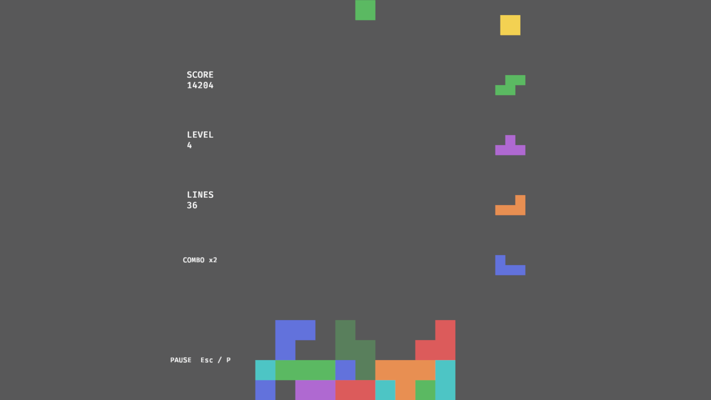
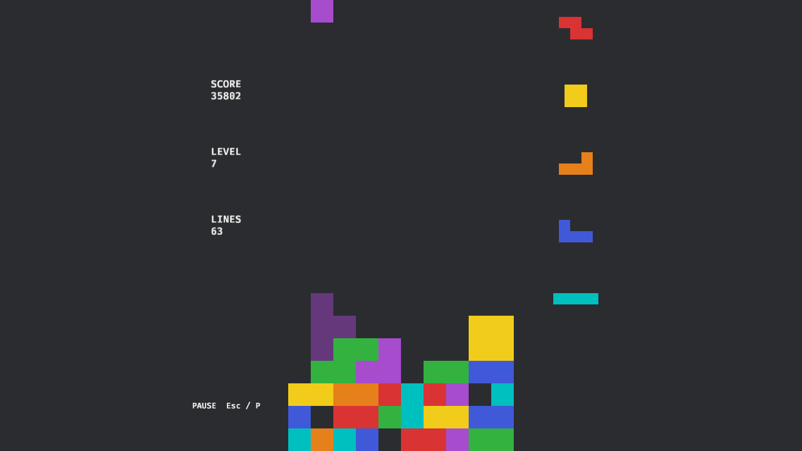
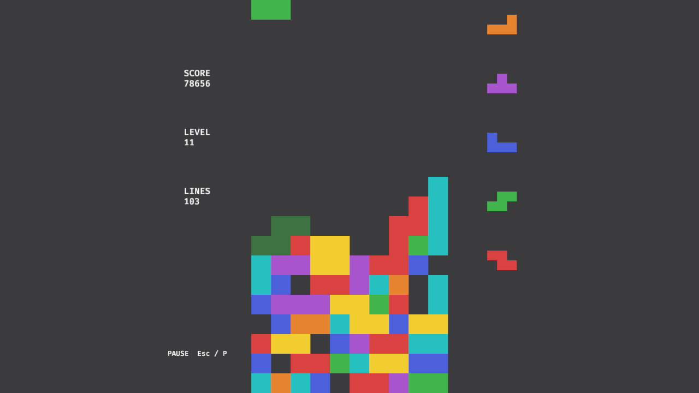

# Blockfall

A fast, modern falling-block puzzle game built in Rust on the
[Bevy](https://bevyengine.org) ECS engine (`tetris` was the working title — see
[PRD.md](PRD.md) §14 #1 for the rename decision). Single-player marathon plus 1v1
versus — local (shared keyboard, human or bot opponent) and online lockstep
netplay (see [Playing online](#playing-online)).

Gameplay follows modern community-standard mechanics: SRS rotation with wall
kicks and T-spin detection, 7-bag randomizer, hold, ghost piece, lock delay,
soft/hard drop, and DAS/ARR input handling.

## Screenshots

Mid-game stack with combo streak (left) and a later level (right):




Deep end-game stack, level 11:



Captured from the real renderer via the `TETRIS_SHOT` hook (see below) with the
greedy bot playing seeded runs.

## Features

- **Arcade marathon mode** — levels, escalating gravity, guideline-style scoring
- **1v1 versus** — local (shared keyboard, human or bot) and **online lockstep
  netplay** over direct IP join, delay-based input sync (default ≈ 133 ms)
- **Modern controls feel** — DAS/ARR, hard drop, lock delay, ghost piece, hold
- **SRS rotation** with wall kicks, including basic T-spin detection
- **7-bag randomizer** with seeded, reproducible runs (`TETRIS_SEED=<u64>`)
- **Title / pause / game-over screens**, settings screen with full key
  rebinding and volume control (persisted to `settings.json`)
- **Audio & juice** — SFX, music, line-clear flash/shake/freeze effects
- **Built-in greedy bot** for soak tests (`TETRIS_BOT=1`)
- Deterministic, engine-free simulation core (`crates/tetris-core`), unit- and
  property-tested with `proptest`

## Controls (defaults, all rebindable in the settings screen)

| Action | Default |
| --- | --- |
| Move left / right | ← / → |
| Soft drop | ↓ |
| Hard drop | Space |
| Rotate CW / CCW | ↑ / Z (X too) |
| Rotate 180 | A |
| Hold | C (Shift too) |
| Pause | Esc / P |

> **Versus & online matches.** The two seats use the fixed P1/P2 presets (not
> the solo bindings above): host/left = P1 (WASD cluster), guest/right = P2
> (arrows). There is **no pause in online matches** — Esc there opens a
> leave-with-confirm instead.

## Playing online

From the title screen: **Online** → **Host** or **Join**. The host listens on
UDP port **27015** (the Host screen shows it with an `ip:port` connect hint);
the guest types `ip:port` at the Join screen
(keyboard-only entry: digits, dots, colon — Bevy 0.19 has no clipboard paste).
Both peers then run the identical deterministic match from a shared seed; inputs
land with a negotiated delay D = max(host, guest), 8 ticks ≈ 133 ms by default
(`TETRIS_NET_DELAY`). Host and guest both see both boards rendered locally —
there is no video/state streaming, only inputs.

- **Automatic router port mapping (UPnP).** When you Host, Blockfall asks
  your router (UPnP IGD) to forward UDP 27015 to your machine, then shows
  **`Friends join at <public-ip>:<port>`** — hand that to your guest and play
  cross-WAN with zero router clicks. The lease is renewable (3600 s, refreshed
  every 30 min while you host) and is deleted when you stop hosting (Esc). If
  the Host screen instead shows **`UPnP unavailable — forward UDP 27015
  manually (see below)`**, that is normal: the router has UPnP disabled, your
  ISP controls the edge device, or the network blocks SSDP — LAN play is
  unaffected. Press **U** on the Host screen to retry or disable the attempt
  (remembered in the net profile).
- **NAT / manual port-forwarding.** If UPnP is unavailable, connections are
  still direct IP: for internet play **port-forward UDP 27015** to your
  machine (and allow it through any host firewall); the Host screen shows the
  host's LAN IPv4 when one exists — over the internet, share your public IP
  (or the address your router's status page shows) instead. LAN play works
  with no setup beyond the firewall.
- **Hosted UDP tunnels no longer work (2026).** Quick tunnels are not an
  option for this game: **ngrok 3.39 removed the `udp` command entirely**
  (only http/tcp/tls remain) and **cloudflared 2026.9 rejects UDP origins**
  (`Currently Cloudflare Tunnel does not support udp protocol`). Netplay is
  raw UDP (netcode), so UPnP/router mapping is the no-infrastructure path.
- **The port is open while listening.** v1 uses unauthenticated netcode
  (protocol-ID check only): anyone who can reach the port with a matching
  protocol version can join while you are listening. Keep sessions short and
  press Esc on the Host screen (`net_stop`) when you are done.
- **No matchmaking.** There is no lobby, relay, LAN discovery or session token
  (all post-v1). A join failure (≈10 s timeout) reads "host offline or match
  full" — netcode cannot tell the two apart with one seat.
- **Mismatched builds** are refused by the version handshake — both sides need
  the same game version.
- Mid-match, Esc opens a confirm ("Leave match?"); leaving sends a graceful bye
  so the opponent sees "opponent left". A desync freezes both boards and offers
  a return to title.

## Build & run

Requires a stable Rust toolchain (pinned to **1.95** via `rust-toolchain.toml`,
which doubles as the project MSRV; `clippy` and `rustfmt` are included):

```sh
rustup show          # installs the pinned toolchain on first run
```

Run the game from the workspace root:

```sh
cargo run
```

> **Audio assets & working directory.** The Bevy asset server resolves
> `crates/tetris-app/assets/` (SFX/BGM WAVs) relative to the process CWD.
> Running via `cargo run` (from the repo root or from `crates/tetris-app`) is
> always correct. Running the built binary directly (e.g.
> `target/release/blockfall`) must be done from `crates/tetris-app/`, or with
> the `assets/` directory placed next to the executable (packaging concern,
> tracked for T20).

The binary is named `blockfall` (`cargo run -p tetris-app` also works; the
package id intentionally stays `tetris-app`).

### Developer env vars

| Variable | Effect |
| --- | --- |
| `TETRIS_SEED=<u64>` | Seed the 7-bag RNG for reproducible runs |
| `TETRIS_BOT=1` | Greedy solver plays marathon (soak tests, captures) |
| `TETRIS_CONFIG_DIR=<path>` | Override the settings/best-score directory |
| `TETRIS_SHOT=<paths>` | Window screenshots via Bevy's built-in `Screenshot` pass: `a.png@90,b.png@1200` captures at the given `Update` frame numbers |
| `TETRIS_NET=host:<port>` / `join:<ip:port>` | Desktop netplay harness: bot-vs-bot-across-the-wire (Garbage → Race), logs `NET match_done`/`final_hash`, exits 0 on matching hashes, 1 on desync/loss/stall |
| `TETRIS_NET_DELAY=<2..=30>` | Desired input delay in ticks for online matches (default 8 ≈ 133 ms); both peers adopt `max(host, guest)` |
| `TETRIS_NET_FORK=guest:<tick>` / `host:<tick>` | Test hook: fork the named peer's mirror at the given tick, proving desync detection fires |

Example — capture a mid-game stack:

```sh
cd crates/tetris-app
TETRIS_BOT=1 TETRIS_SEED=7 \
TETRIS_SHOT=/tmp/shot.png@900 \
../../target/release/blockfall
```

## App icon

`crates/tetris-app/assets/icon.png` (1024×1024, generated by
`crates/tetris-app/assets/generate_icon.py`) is the app icon. **Bevy 0.19
removed the runtime window-icon API** (`Window::icon` / `WindowIcon` no longer
exist; verified against `bevy_window` 0.19.1), so the icon is wired for desktop
integration instead of at runtime:

- GNOME/Wayland shows icons by matching the window app-id against an installed
  `.desktop` file. Packaging (T20) should install a `blockfall.desktop` whose
  `Icon=` points at the hicolor-installed PNG (winit derives the app-id from
  the binary name).
- Revisit a runtime icon when Bevy re-exposes one; until then this is the only
  correct placement. The window title ("Blockfall") is applied at runtime by a
  registered plugin (`juice.rs`), keeping `main.rs` frozen.

## Project layout

```
tetris/
├── Cargo.toml                # workspace root (virtual)
├── crates/
│   ├── tetris-core/          # pure, deterministic game rules (no engine deps)
│   │                         # board, pieces, SRS, randomizer, scoring, FSM
│   └── tetris-app/           # Bevy binary: rendering, input, UI, audio
│       └── assets/           # sfx/, bgm_loop.wav, icon.png (+ generators)
├── assets/screenshots/       # README screenshots (TETRIS_SHOT captures)
├── PRD.md                    # product requirements
├── netplay-plan.md           # netplay task plan N1–N8 (online 1v1)
└── tetris-plan.md            # task plan T0–T26
```

`tetris-core` never links Bevy — the app side bridges a fixed-step simulation
through snapshots, which keeps the rules testable headlessly.

## Development

```sh
cargo test --workspace    # unit + proptest suite (core is headless)
cargo clippy --workspace -- -D warnings
cargo fmt --all --check
```

## CI & releases

GitHub Actions runs `fmt --check`, `clippy -D warnings` and `cargo test --workspace`
on every push/PR (Linux; the runner installs `libasound2-dev` and `libudev-dev`
for Bevy's audio/device backends), plus a nightly `--ignored` soak of
`tetris-core`. Pushing a `v*` tag builds release binaries for Linux, Windows and
macOS and attaches them to the GitHub release.

Note: release archives contain the `blockfall` binary only. The game loads its
assets from `crates/tetris-app/assets` relative to the current working
directory, so unpack the binary next to a copy of that `assets/` directory to
run it. Proper bundling (`cargo bundle`, desktop file, icon install) is future
work.

## Status

Pre-release (see [PRD.md](PRD.md) for milestones; release/tag flow in
tetris-plan.md T22).
